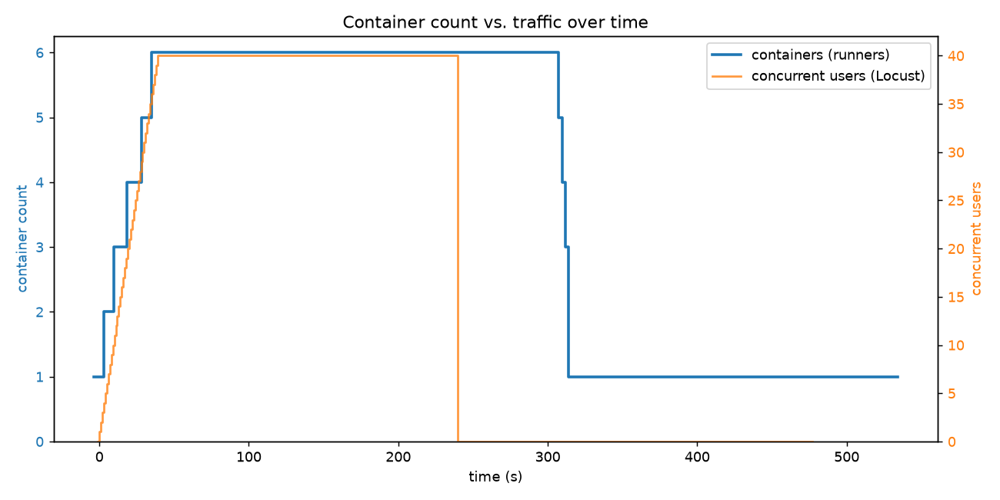
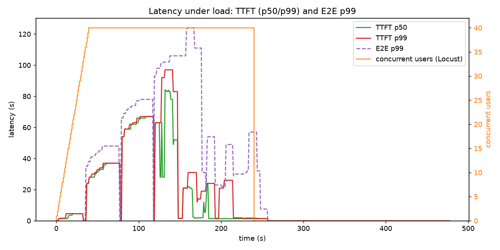

# Writeup: Autoscaling CPU inference for Qwen3-0.6B on Modal

## What was built

An OpenAI-compatible inference API serving **Qwen3-0.6B on CPU** with **vLLM**,
deployed on **Modal**, that autoscales container count with traffic (down to
a minimum of 1 during lulls) and handles a 40-concurrent load test.

## Architecture

```
client ──HTTP──▶  Modal proxy / load balancer  ──▶  [ vLLM container ]   (CPU)
(OpenAI SDK,                (routing +              [ vLLM container ]   autoscaled
 curl, Locust)              autoscaling)            [ vLLM container ]   1..N
                                                        ...
```

- **One Modal class** (`VllmServer` in `app.py`) runs vLLM's OpenAI-compatible
  server (`vllm serve Qwen/Qwen3-0.6B`) as a subprocess inside `@modal.enter()`,
  exposed via [`@modal.web_server(port=8000)`](https://modal.com/docs/guide/webhooks#web-server).
  vLLM natively serves `/v1/chat/completions`, so the Modal URL *is* the OpenAI
  base URL — no custom API layer needed. `--enforce-eager` skips vLLM's graph
  compilation step, cutting cold-start time significantly (per the
  [vLLM CPU installation guide](https://docs.vllm.ai/en/latest/getting_started/installation/cpu.html)).
- **Routing to model servers** is handled by Modal's built-in proxy/load
  balancer. I deliberately did not hand-roll a router: Modal already
  distributes requests across healthy containers and tracks per-container load.
- **CPU serving**: the container uses the prebuilt `vllm/vllm-openai-cpu` image
  (no GPU), `dtype=bfloat16` (stable on CPU), with `VLLM_CPU_KVCACHE_SPACE`
  reserving KV-cache room for many concurrent sequences.
- **Weights** are cached in a Modal Volume (prefetched once via
  `download_model`) so cold starts don't re-download the model. This pattern
  mirrors Modal's [official vLLM inference example](https://modal.com/docs/examples/vllm_inference).

## How autoscaling works here

Two layers, both configured in `app.py`:

1. **Per-container concurrency** — [`@modal.concurrent(max_inputs=12,
   target_inputs=8)`](https://modal.com/docs/guide/concurrent-inputs). vLLM does
   continuous (token-level) batching, so a single CPU container serves many
   requests at once. The autoscaler aims for `target_inputs` concurrent requests
   per container and lets a container burst up to `max_inputs` while new
   containers spin up.

2. **Container pool** — `min_containers=1`, `max_containers=8`,
   `scaledown_window=60` (see [Modal autoscaling docs](https://modal.com/docs/guide/scale)).
   When offered load exceeds `runners × target_inputs`, Modal starts new
   containers (up to the max). When load drops, idle containers are retired
   after `scaledown_window` seconds, down to the `min_containers=1` floor.

With `target_inputs=8`, 40 concurrent requests settle onto roughly
`40 / 8 ≈ 5` containers, with headroom up to 8.

**Cold starts:** a fresh vLLM-on-CPU container takes time to become ready
(image pull + model load from the Volume + vLLM engine init). Initially this
was ~5–6 minutes. Adding `--enforce-eager` to the `vllm serve` command skips
vLLM's graph compilation step, cutting cold-start time to **1–2 minutes**.

I also attempted [Modal memory snapshots](https://modal.com/docs/guide/memory-snapshots)
(`enable_memory_snapshot=True`) to reduce this further — the idea being that
Modal snapshots the container's full memory state (including the vLLM subprocess
with loaded weights) and restores it in seconds on subsequent wakeups. In
practice, subsequent cold starts were no faster than the first — the snapshot
did not appear to restore the subprocess state reliably on CPU. Modal's
[documented snapshot examples for vLLM](https://modal.com/docs/examples/lfm_snapshot)
use `--enable-sleep-mode` to put vLLM into a clean state before snapshotting
(a GPU-specific feature); without an equivalent on CPU, the restore path did
not work as expected.

Instead I use `min_containers=1` to keep one container permanently warm,
eliminating cold starts for the first request. Scale-up events (new containers
joining during load) still pay the 1–2 min cold-start cost, which is visible
as latency spikes in Graph 2 during the ramp-up phase.

## Results

Load profile (driven by Locust's `LoadTestShape`): ramp 0→40 users, sustain at
40, then drop to 0 and idle so scale-down is visible. Latencies are measured
client-side per request: **TTFT** (time to first streamed token) and **E2E**
(full streamed response).

### Graph 1 — Container count vs. traffic over time



> Container count (left axis) tracks concurrent users (right axis): it climbs
> as load ramps to 40, holds at 6 during the sustain phase, then steps back down
> to 1 (`min_containers`) after traffic stops and the `scaledown_window` elapses
> per container.

### Graph 2 — Latency under 40 concurrent (TTFT and p99)



> TTFT p50/p99 and E2E p99 during the run. Spikes line up with scale-up events
> (requests routed to cold containers); latency settles once the pool is warm.

Measured over the full run (including ramp-up cold-start spikes; p99 reflects
worst-case requests that hit containers still initialising):

| Metric | p50 | p99 |
| ------ | --- | --- |
| TTFT   | 1.5s | 97s |
| E2E    | 31s  | 124s |

The high p99 values are dominated by requests routed to containers during their
1–2 min cold-start window. Once all 6 containers are warm, TTFT p50 settles
around 1–2s and E2E p50 around 30s — consistent with CPU decode speed for
Qwen3-0.6B at 128 output tokens.

## How to reproduce

See `README.md` — deploy with `modal deploy app.py`, run `poll_stats.py` +
Locust, then `plot.py` to regenerate both graphs.

## Possible improvements

- **Quantization** — run Qwen3-0.6B in INT4/INT8 (AWQ/GPTQ via vLLM). Would
  significantly cut per-token CPU compute, bringing TTFT p50 from ~1.5s toward
  sub-second and reducing cold-start time.
- **More CPU cores** — raise `cpu=8` to 16 or 32; vLLM's OpenMP threads scale
  with available cores, directly speeding up decode.
- **KV-cache aware routing** — Modal's proxy does simple load balancing with no
  awareness of per-container KV-cache state. For multi-turn conversations,
  sticky session routing (via `Modal-Session-ID` header) or an orchestrator like
  NVIDIA Dynamo would improve cache hit rates and reduce TTFT.
- **Blue/green → canary deploys** — rolling out new model versions with canary
  traffic splitting rather than a hard cutover.
